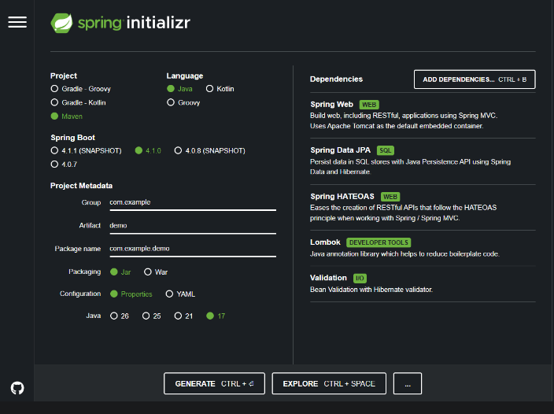
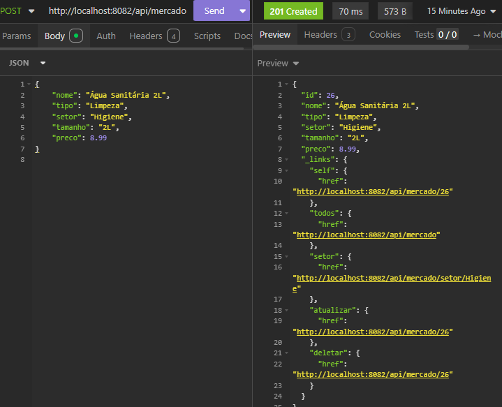
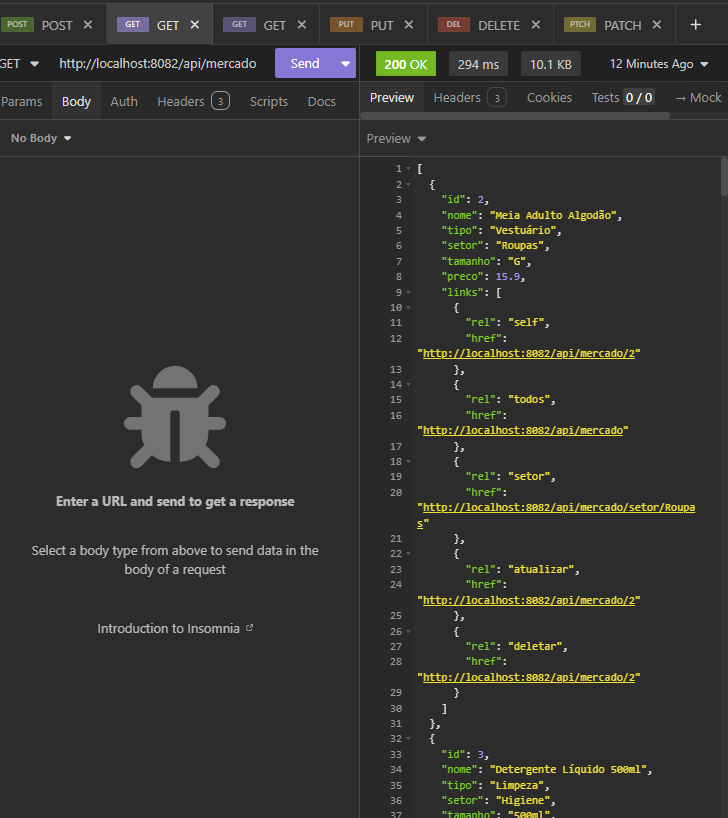
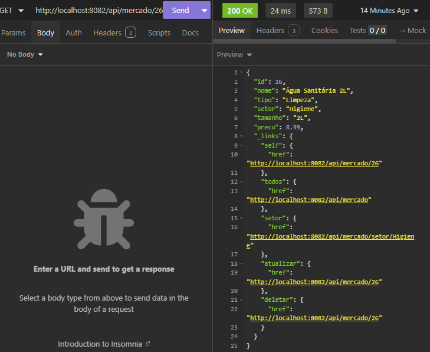
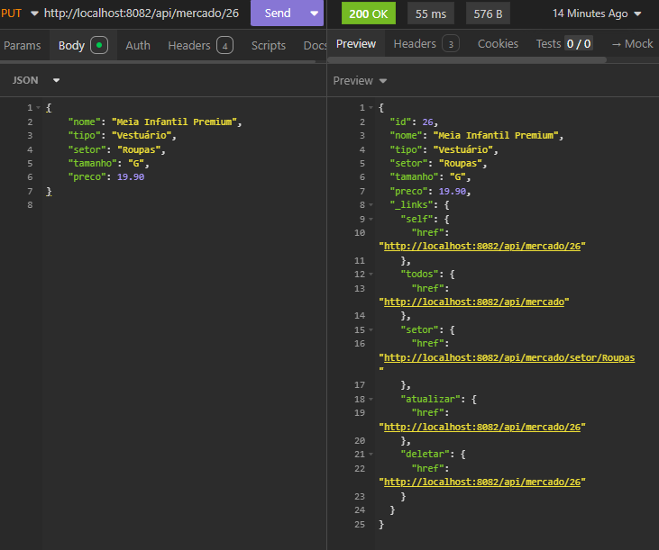
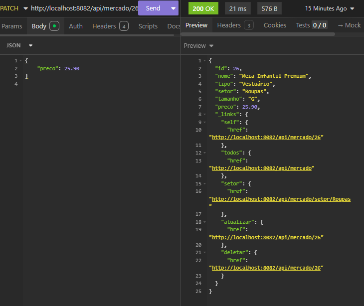
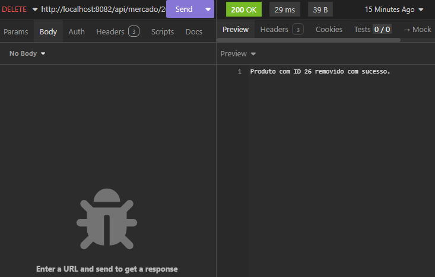
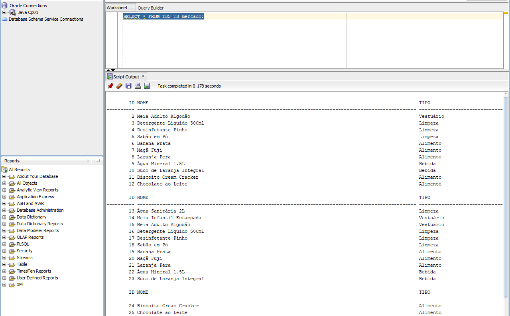

# CP4 JATD — Mercado Express

## Checkpoint 4 — Parte 1: API e Deploy

---

## 1. Identificação

| Item | Descrição |
| --- | --- |
| **Curso** | Tecnologia em Análise em Desenvolvimento de Sistemas (TDS) — FIAP |
| **Professor** | Dr. Marcel Stefan Wagner |
| **Checkpoint** | CP4 — Parte 1 (API e Deploy) |
| **IDE utilizada** | IntelliJ IDEA |
| **Ferramenta de teste** | Insomnia |
| **Banco de dados** | Oracle SQL Developer (ORACLE_FIAP) |
| **Framework** | Spring Boot 3.2.5 com Maven |

### Integrantes do Grupo

| Nome                         | RM   |
|------------------------------|------|
| [Gabriel Robertoni Padilha]  | [566293] |
| [Bruno Ferreira]             | [563489]   |
| [Leonardo Aragaki Rodrigues] | [562944]   |

**Link do repositório GitHub:** https://github.com/GabrielRobertoni/CP4-MercadoExpress-Java.git

---

## 2. Sobre o Projeto

Este projeto implementa uma **API REST** para uma empresa do tipo **Mercado Express**, que comercializa produtos variados como meias, produtos de limpeza, frutas, bebidas e snacks. A aplicação foi desenvolvida em **Java 17** utilizando o framework **Spring Boot** com **Maven**, incluindo a dependência **Lombok** para redução de código boilerplate.

A API expõe endpoints HTTP que realizam as operações completas de **CRUD** (Create, Read, Update e Delete ) sobre uma tabela `TDS_TB_mercado` no banco de dados **Oracle FIAP**. As respostas seguem o padrão **HATEOAS** (nível de maturidade 3 de Richardson), incluindo hiperlinks para navegação entre recursos.

### Arquitetura

```
┌──────────────────────────┐     HTTP      ┌──────────────────────┐
│      Aplicação Java      │ ◄───────────► │   Insomnia / Postman │
│   (Spring Boot + Maven)  │    (JSON)     │   (Cliente REST)     │
│                          │               │                      │
│  • Entity Manager        │               └──────────────────────┘
│  • Repository (JPA)      │
│  • Service               │
│  • Controller (REST)     │
│  • Lombok                │
│  • HATEOAS               │
└─────────────┬────────────┘
              │ JPA / JDBC
              ▼
┌──────────────────────────┐
│    BD Oracle FIAP        │
│  Tabela: TDS_TB_mercado  │
│  (SQL Developer)         │
└──────────────────────────┘
```

---

## 3. Tecnologias e Dependências

### Spring Initializr

A configuração utilizada no [Spring Initializr](https://start.spring.io) foi a seguinte:

| Campo | Valor |
| --- | --- |
| Project | Maven |
| Language | Java |
| Spring Boot | 3.2.5 |
| Packaging | Jar |
| Java | 17 |
| Configuration | Properties |

### Dependências selecionadas

| Dependência | Função |
| --- | --- |
| **Spring Web** | Criação de endpoints REST com Tomcat embutido |
| **Spring Data JPA** | Persistência de dados via Hibernate/JPA |
| **Spring HATEOAS** | Retorno com hiperlinks (nível de maturidade 3) |
| **Spring Data REST** | Exposição de repositórios como REST |
| **Validation** | Validação de dados de entrada |
| **Lombok** | Geração automática de getters, setters, construtores |
| **H2 Database** | Banco em memória para testes locais |
| **Oracle JDBC (ojdbc11)** | Driver para conexão com Oracle FIAP |


---

## 4. Estrutura do Projeto

```
CP4-MercadoExpress/
├── pom.xml                              # Dependências Maven
├── README.md                            # Este arquivo
├── src/
│   ├── main/
│   │   ├── java/com/fiap/cp4/
│   │   │   ├── MercadoExpressApplication.java    # Classe principal (@SpringBootApplication)
│   │   │   ├── model/
│   │   │   │   ├── Produto.java                  # Entity JPA (@Entity, @Table, @Lombok)
│   │   │   │   ├── ProdutoDTO.java               # DTO para entrada de dados
│   │   │   │   └── ProdutoModel.java             # Modelo HATEOAS (RepresentationModel)
│   │   │   ├── repository/
│   │   │   │   └── ProdutoRepository.java        # Repository JPA (JpaRepository)
│   │   │   ├── service/
│   │   │   │   └── ProdutoService.java           # Lógica de negócio (CRUD)
│   │   │   ├── controller/
│   │   │   │   └── ProdutoController.java        # Endpoints REST (@RestController)
│   │   │   ├── assembler/
│   │   │   │   └── ProdutoModelAssembler.java    # Assembler HATEOAS (RepresentationModelAssembler)
│   │   │   ├── config/
│   │   │   │   └── DataInitializer.java          # Inserção de dados iniciais
│   │   │   └── exception/
│   │   │       └── GlobalExceptionHandler.java   # Tratamento global de erros
│   │   └── resources/
│   │       ├── application.properties            # Configurações (Oracle)
│   │       └── schema.sql                        # Schema SQL (H2)
│   └── test/
│       └── java/com/fiap/cp4/
│           └── ProdutoControllerTest.java        # Testes automatizados (MockMvc)
└── .gitignore
```

---

## 5. Banco de Dados

### Tabela: TDS_TB_mercado

A tabela foi criada no banco **Oracle FIAP** (acessado via Oracle SQL Developer) com a seguinte estrutura:

| Coluna | Tipo | Descrição |
| --- | --- | --- |
| **id** | NUMBER (PK, Identity) | Identificador único do produto |
| **nome** | VARCHAR2(100) | Nome do produto |
| **tipo** | VARCHAR2(50) | Tipo do produto (Vestuário, Limpeza, Alimento, Bebida) |
| **setor** | VARCHAR2(100) | Setor (Roupas, Higiene, Frutas, Bebidas, Mercearia, Doces) |
| **tamanho** | VARCHAR2(50) | Tamanho ou volume do produto |
| **preco** | NUMBER(10,2) | Preço do produto em reais |

### Script de criação

```sql
CREATE TABLE TDS_TB_mercado (
    id        NUMBER GENERATED BY DEFAULT AS IDENTITY PRIMARY KEY,
    nome      VARCHAR2(100) NOT NULL,
    tipo      VARCHAR2(50),
    setor     VARCHAR2(100),
    tamanho   VARCHAR2(50),
    preco     NUMBER(10, 2)
);
COMMIT;
```

### Configuração (application.properties)

A conexão com o Oracle é configurada via `application.properties`:

```
server.port=8082

spring.datasource.url=jdbc:oracle:thin:@oracle.fiap.com.br:1521:ORCL
spring.datasource.driver-class-name=oracle.jdbc.OracleDriver
spring.datasource.username=rm566293
spring.datasource.password=fiap26

spring.jpa.hibernate.ddl-auto=none
spring.jpa.show-sql=true
spring.jpa.properties.hibernate.dialect=org.hibernate.dialect.OracleDialect
```

---

## 6. Endpoints da API (CRUD Completo)

Base URL: `http://localhost:8082/api/mercado`

### 6.1. CREATE — Criar Produto (POST )

**Endpoint:** `POST http://localhost:8082/api/mercado`

**Corpo JSON enviado via Insomnia:**

```json
{
    "nome": "Meia Infantil Estampada",
    "tipo": "Vestuário",
    "setor": "Roupas",
    "tamanho": "P",
    "preco": 12.90
}
```

**Resposta (HTTP 201 Created ) com links HATEOAS:**

```json
{
    "id": 1,
    "nome": "Meia Infantil Estampada",
    "tipo": "Vestuário",
    "setor": "Roupas",
    "tamanho": "P",
    "preco": 12.90,
    "_links": {
        "self": { "href": "http://localhost:8082/api/mercado/1" },
        "todos": { "href": "http://localhost:8082/api/mercado" },
        "setor": { "href": "http://localhost:8082/api/mercado/setor/Roupas" },
        "atualizar": { "href": "http://localhost:8082/api/mercado/1" },
        "deletar": { "href": "http://localhost:8082/api/mercado/1" }
    }
}
```


---

### 6.2. READ — Listar Todos os Produtos (GET)

**Endpoint:** `GET http://localhost:8082/api/mercado`

**Resposta (HTTP 200 OK ):**

```json
[
    {
        "id": 2,
        "nome": "Meia Adulto Algodão",
        "tipo": "Vestuário",
        "setor": "Roupas",
        "tamanho": "G",
        "preco": 15.90,
        "_links": {
            "self": { "href": "http://localhost:8082/api/mercado/2" },
            "todos": { "href": "http://localhost:8082/api/mercado" },
            "setor": { "href": "http://localhost:8082/api/mercado/setor/Roupas" },
            "atualizar": { "href": "http://localhost:8082/api/mercado/2" },
            "deletar": { "href": "http://localhost:8082/api/mercado/2" }
        }
    },
    {
        "id": 3,
        "nome": "Detergente Líquido 500ml",
        "tipo": "Limpeza",
        "setor": "Higiene",
        "tamanho": "500ml",
        "preco": 4.99,
        "_links": {  }
    }
]
```


---

### 6.3. READ — Buscar por ID (GET)

**Endpoint:** `GET http://localhost:8082/api/mercado/{id}`

**Resposta (HTTP 200 OK ):**

```json
{
    "id": 3,
    "nome": "Detergente Líquido 500ml",
    "tipo": "Limpeza",
    "setor": "Higiene",
    "tamanho": "500ml",
    "preco": 4.99,
    "_links": {
        "self": { "href": "http://localhost:8082/api/mercado/3" },
        "todos": { "href": "http://localhost:8082/api/mercado" },
        "setor": { "href": "http://localhost:8082/api/mercado/setor/Higiene" },
        "atualizar": { "href": "http://localhost:8082/api/mercado/3" },
        "deletar": { "href": "http://localhost:8082/api/mercado/3" }
    }
}
```

---

### 6.4. READ — Buscar por Nome (GET )

**Endpoint:** `GET http://localhost:8082/api/mercado/buscar?nome=meia`

**Resposta (HTTP 200 OK ):** Retorna lista de produtos cujo nome contém o termo buscado (case-insensitive).

---

### 6.5. READ — Buscar por Setor (GET)

**Endpoint:** `GET http://localhost:8082/api/mercado/setor/{setor}`

**Resposta (HTTP 200 OK ):** Retorna lista de produtos do setor informado.

---

### 6.6. UPDATE — Atualizar Produto (PUT)

**Endpoint:** `PUT http://localhost:8082/api/mercado/{id}`

**Corpo JSON (substituição completa ):**

```json
{
    "nome": "Meia Adulto Premium",
    "tipo": "Vestuário",
    "setor": "Roupas",
    "tamanho": "G",
    "preco": 25.90
}
```

**Resposta (HTTP 200 OK):** Retorna o produto atualizado com links HATEOAS.


---

### 6.7. PATCH — Atualizar Parcialmente

**Endpoint:** `PATCH http://localhost:8082/api/mercado/{id}`

**Corpo JSON (apenas campos a atualizar ):**

```json
{
    "preco": 29.90
}
```

**Resposta (HTTP 200 OK):** Retorna o produto com apenas o campo `preco` atualizado, mantendo os demais inalterados.


---

### 6.8. DELETE — Remover Produto

**Endpoint:** `DELETE http://localhost:8082/api/mercado/{id}`

**Resposta (HTTP 200 OK ):**

```
Produto com ID 1 removido com sucesso.
```

O registro é excluído diretamente do banco de dados Oracle.


---

## 7. HATEOAS — Nível de Maturidade 3

O projeto implementa o padrão **HATEOAS** (Hypermedia as the Engine of Application State), que corresponde ao **nível 3** do modelo de maturidade de Richardson. Cada resposta da API inclui um objeto `_links` com hiperlinks que permitem ao cliente navegar entre os recursos sem precisar conhecer a estrutura da URL previamente.

### Links disponíveis em cada resposta:

| Link | Rel | Descrição |
| --- | --- | --- |
| `self` | O próprio recurso | URL para acessar o produto específico |
| `todos` | Collection | URL para listar todos os produtos |
| `setor` | Filtro por setor | URL para filtrar produtos do mesmo setor |
| `atualizar` | Operação PUT | URL para atualizar o produto |
| `deletar` | Operação DELETE | URL para remover o produto |

### Implementação

O assembler `ProdutoModelAssembler` estende `RepresentationModelAssemblerSupport` e adiciona os links automaticamente:

```java
@Component
public class ProdutoModelAssembler extends RepresentationModelAssemblerSupport<Produto, ProdutoModel> {

    @Override
    public ProdutoModel toModel(Produto produto) {
        ProdutoModel model = ProdutoModel.builder()
                .id(produto.getId())
                .nome(produto.getNome())
                .tipo(produto.getTipo())
                .setor(produto.getSetor())
                .tamanho(produto.getTamanho())
                .preco(produto.getPreco())
                .build();

        model.add(linkTo(methodOn(ProdutoController.class).buscarPorId(produto.getId())).withSelfRel());
        model.add(linkTo(methodOn(ProdutoController.class).listarTodos()).withRel("todos"));
        model.add(linkTo(methodOn(ProdutoController.class).buscarPorSetor(produto.getSetor())).withRel("setor"));
        model.add(linkTo(methodOn(ProdutoController.class).atualizarProduto(produto.getId(), null)).withRel("atualizar"));
        model.add(linkTo(methodOn(ProdutoController.class).deletarProduto(produto.getId())).withRel("deletar"));

        return model;
    }
}
```

---

## 8. Lombok

O projeto utiliza **Lombok** obrigatoriamente em todas as classes de modelo, DTO e assembler. As anotações utilizadas são:

| Anotação | Onde | Função |
| --- | --- | --- |
| `@Getter` | Produto, ProdutoDTO, ProdutoModel | Gera getters automaticamente |
| `@Setter` | Produto, ProdutoDTO, ProdutoModel | Gera setters automaticamente |
| `@NoArgsConstructor` | Todos os modelos | Construtor sem parâmetros |
| `@AllArgsConstructor` | Todos os modelos | Construtor com todos os parâmetros |
| `@Builder` | Todos os modelos | Pattern Builder para criação de objetos |

---

## 9. Como Executar

### Pré-requisitos

- Java 17+ instalado

- IntelliJ IDEA

- Maven integrado na IDE

- Oracle SQL Developer (conexão com Oracle FIAP)

- Insomnia ou Postman

### Passo a passo

1. Clone ou baixe o repositório do GitHub

1. Abra o projeto no IntelliJ IDEA (File → Open)

1. Aguarde o Maven baixar as dependências automaticamente

1. Instale o plugin Lombok (File → Settings → Plugins → buscar "Lombok")

1. Ative Annotation Processors (File → Settings → Build → Compiler → Annotation Processors → Enable)

1. Configure o `application.properties` com as credenciais do Oracle FIAP

1. Execute a classe `MercadoExpressApplication.java`

1. A API estará disponível em [http://localhost:8082](http://localhost:8082)

---

## 10. Deploy

O projeto foi deployado na plataforma **Render** ([https://render.com](https://render.com) ) como Web Service Java. A URL pública da API está disponível no link abaixo:

**URL da API em produção:** [https://cp4-mercadoexpress-java.onrender.com](https://cp4-mercadoexpress-java.onrender.com)

**Endpoint principal da API:** [https://cp4-mercadoexpress-java.onrender.com/api/mercado](https://cp4-mercadoexpress-java.onrender.com/api/mercado)

Configuração do banco de dados: Por questões de configuração e compatibilidade com o ambiente de deploy, as informações de conexão com o banco Oracle são definidas por meio das variáveis de ambiente DB_URL, DB_USERNAME e DB_PASSWORD. Para execução local, essas variáveis devem ser configuradas na IDE ou no sistema operacional. A aplicação utiliza a porta 8082 por padrão, podendo utilizar automaticamente a porta fornecida pelo ambiente de deploy através da variável PORT.

Username: Rm566293
Password: fiap26
URL: jdbc:oracle:thin:@oracle.fiap.com.br:1521:ORCL

*(Substitua pela URL real do seu deploy )*

### Como gerar o JAR para deploy:

```bash
mvn clean package -DskipTests
```

---

## 11. Dados Iniciais

Ao iniciar a aplicação, 12 produtos de exemplo são inseridos automaticamente na tabela `TDS_TB_mercado`:

| Nome | Tipo | Setor | Tamanho | Preço |
| --- | --- | --- | --- | --- |
| Meia Infantil Estampada | Vestuário | Roupas | P | R$ 12,90 |
| Meia Adulto Algodão | Vestuário | Roupas | G | R$ 15,90 |
| Detergente Líquido 500ml | Limpeza | Higiene | 500ml | R$ 4,99 |
| Desinfetante Pinho | Limpeza | Higiene | 1L | R$ 7,50 |
| Sabão em Pó | Limpeza | Higiene | 1kg | R$ 18,90 |
| Banana Prata | Alimento | Frutas | 1kg | R$ 5,99 |
| Maçã Fuji | Alimento | Frutas | 1kg | R$ 8,99 |
| Laranja Pera | Alimento | Frutas | 1kg | R$ 4,50 |
| Água Mineral 1.5L | Bebida | Bebidas | 1.5L | R$ 2,99 |
| Suco de Laranja Integral | Bebida | Bebidas | 1L | R$ 9,90 |
| Biscoito Cream Cracker | Alimento | Mercearia | 400g | R$ 6,49 |
| Chocolate ao Leite | Alimento | Doces | 90g | R$ 5,90 |

---

## 12. Prints de Evidência

| Print | Descrição |
|  | --- |
|  | Configuração das dependências no Spring Initializr |
|  | POST — Criação de produto |
|  | GET — Listagem de todos os produtos |
|  | GET — Busca por ID |
|  | PUT — Atualização completa |
|  | PATCH — Atualização parcial |
|  | DELETE — Remoção por ID |
| ! | ORACLE
---

## 13. Conclusão

O projeto atende a todos os requisitos do Checkpoint 4 — Parte 1:

- ✅ Spring Boot com Maven e Java

- ✅ Dependências incluindo Lombok

- ✅ Persistência via JPA/Oracle (application.properties)

- ✅ Tabela `TDS_TB_mercado` com colunas Id, Nome, Tipo, Setor, Tamanho e Preco

- ✅ CRUD completo (Create, Read, Update, Delete)

- ✅ Testes via Insomnia em localhost:8082

- ✅ Estrutura JSON para POST, PUT e PATCH

- ✅ DELETE pelo ID

- ✅ Lombok obrigatório

- ✅ HATEOAS (nível de maturidade 3)

- ✅ Deploy com link via GitHub

---

*Projeto desenvolvido para o Checkpoint 4 do curso TDS da FIAP.*
